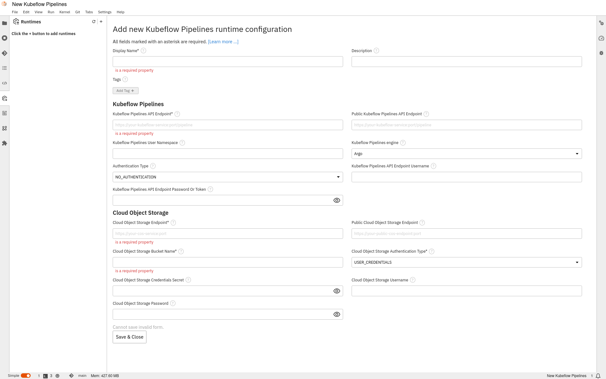

Elyra Notebooks for The Zone
===

Repository contains sample Jupyter notebooks showcasing how Elyra works and how it can benefit users of The Zone at Statistics Canada. This README contains a brief description to what Elyra is and references to further reading and links to the notebooks and explanations of each notebook, we'll also outline the benefits, costs, and strategic alignment of implementing Elyra in The Zone, demonstrating how it can empower a broader range of users, improve collaboration, and deployment of data solutions with minimal coding expertise required.

# What is Elyra

Elyra provides a graphical way of orchestrating work done as a sequence of steps, each step is executed by a Kubeflow Pipeline Component. Each of these components typically only implements one unit-of-work, such as loading data, transforming data, training a model, or deploying a model to serve. For more information, see [pipeline components](https://elyra.readthedocs.io/en/v3.15.0/user_guide/pipeline-components.html).

Elyra offers a graphical interface to configure the connection to Kubeflow Pipelines.



To learn more about adding and / or configuring pipeline runtimes, see [managing runtime configurations using the jupyterlab ui](https://elyra.readthedocs.io/en/v3.15.0/user_guide/runtime-conf.html#managing-runtime-configurations-using-the-jupyterlab-ui).

## Business Case for Low-Code / No-Code in The Zone

Integrating Elyra within the The Zone ecosystem offers a unique opportunity to enhance accessibility for low-code / no-code and less technical users. Elyra uses an client server model, and installed through pip as an extension for JupyterLab. If you just want to try Elyra's UI, you can run it locally with:

``` bash
docker run -it -p 8888:8888 -v ${HOME}/jupyter-notebooks/:/home/jovyan/work -w /home/jovyan/work elyra/elyra:latest jupyter lab --debug 

```

and then open your browser to [localhost](http://localhost:8888).


Elyra provides a suite of user-friendly tools that simplify development and management of AI models and code. 

## Background

The Zone is an open-source platform designed to facilitate the deployment, orchestration, and management of machine learning workflows on Kubernetes. Elyra enhances JupyterLab with features that support development, including visual pipeline editors, reusable code snippets, and comprehensive project management tools. These features are particularly beneficial for users with limited coding experience.

## Dependencies

Elyra relies on the installation of Kubeflow pipelines.

## Objectives

1. Empower Non-Technical Users: Enable less technical team members to participate in development through Elyra’s intuitive, low-code / no-code tools.
2. Enhance Collaboration: Foster collaboration between technical and non-technical team members using Elyra’s user-friendly interface and project management features.
3. Accelerate Deployment: Reduce the time from development to production by leveraging Elyra’s visual pipeline capabilities and the Zone’s scalable infrastructure.

## Benefits

### Increased Accessibility

Elyra’s visual pipeline editor allows users to create workflows through a drag-and-drop interface, making it accessible to those with minimal coding skills.

### Enhanced Collaboration

With Elyra, team members of varying technical expertise can easily share and reuse code snippets and visual components, ensuring consistency and reducing redundancy in development efforts.

## Costs

### Initial Setup

The initial setup costs involve configuring Elyra within the existing The Zone environment after Kubeflow piplines has been implemented into the Zone.

### Ongoing Maintenance

Regular updates and maintenance of the Elyra and The Zone environments will be necessary to ensure compatibility and to take advantage of new features and improvements.

### Training

Providing comprehensive training sessions for both technical and non-technical team members to familiarize them with Elyra’s features and how to integrate them effectively with The Zone.

Strategic Alignment
Supporting Innovation
By adopting Elyra within The Zone, the organization positions itself at the forefront of innovation, leveraging low-code/no-code tools to drive business value and inclusivity.
Enhancing Capabilities
This integration aligns with the strategic goal of enhancing our capabilities, enabling a wider range of team members to contribute to sophisticated analyses and decision-making processes.
User Adoption
Mitigating the risk of low user adoption by providing extensive training and support to both technical and non-technical users, ensuring they are comfortable and proficient with the new tools.
Maintenance Overhead
Addressing the maintenance overhead by establishing a dedicated team responsible for managing the Elyra-The Zone environment and ensuring seamless operation.
Conclusion
Integrating Elyra within The Zone presents a compelling opportunity to democratize development and deployment of workflows. By adopting Elyra in The Zone, we can empower a broader range of users, and drive significant value.
 
 
